# Test Case Documentation

---

## Test Case 1.1: Verify Application Launches as Desktop App

### **Description**
Ensure the application runs as a native desktop app on various platforms.

---

### **Test Environment**
- **Platforms:** Windows, macOS, Linux
- **Electron Version:** `33.3.0`
- **Node.js Version:** `18.20.5`
- **Build Tool:** `electron-builder 25.1.8`

---

### **Steps Executed**
1. **Package the application:**
   - Used `electron-builder` to package the application for Windows (`.exe`), macOS (`.dmg`), and Linux (`.AppImage`).
   - Command executed:
     ```bash
     npm run dist
     ```
     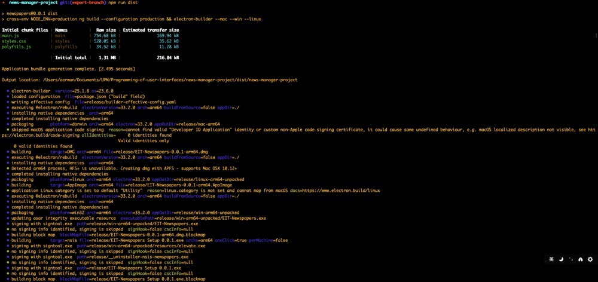

   - **Output Location:**
     ```
     dist/news-manager-project/
     ```

   - **Build Artifacts:**
     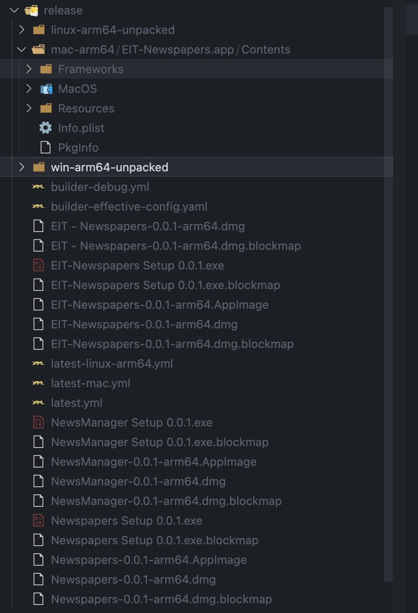

2. **Install the application on each platform:**
   - **Windows:** Installed the app by running the `.exe`.
   - **macOS:** Installed the app by opening the `.dmg` and dragging it to Applications.
   - **Linux:** Installed the app by executing the `.AppImage`.

3. **Launch the app:**
   - Verified that the app launches successfully without errors on each platform.

4. **UI Verification:**
   - Confirmed the main UI of the app is displayed correctly:
     - Navigation menu is visible.
     - Featured articles and categories are displayed correctly.

---

### **Expected Result**
Application launches without errors and displays the main UI.

---

### **Actual Result**
Test passed. The application launched successfully on all platforms and displayed the expected UI.

---
### **Build Configuration in `package.json`**

The following `build` script and configuration in `package.json` were used to package the application:

```json
{
  "scripts": {
    "start": "ng serve",
    "build": "ng build --configuration production",
    "electron": "cross-env NODE_ENV=development electron .",
    "electron:serve": "concurrently \"cross-env NODE_ENV=development ng serve\" \"wait-on http://localhost:4200 --http-timeout 5000 --timeout 60000 && electron .\"",
    "electron:build": "cross-env NODE_ENV=production ng build --configuration production && electron .",
    "dist": "cross-env NODE_ENV=production ng build --configuration production && electron-builder --mac --win --linux",
    "watch": "ng build --watch --configuration development",
    "test": "ng test",
    "postinstall": "electron-builder install-app-deps"
  },
  "build": {
    "appId": "com.newspapers.app",
    "productName": "EIT-Newspapers",
    "files": [
      "dist/**/*",
      "main.js",
      "preload.js",
      "package.json"
    ],
    "directories": {
      "output": "release"
    },
    "win": {
      "target": "nsis",
      "icon": "public/favicon.ico"
    },
    "mac": {
      "target": "dmg",
      "icon": "public/favicon.icns"
    },
    "linux": {
      "target": "AppImage",
      "icon": "public/favicon.png"
    }
  },
}
```


### **Screenshots**
- **macOS:** 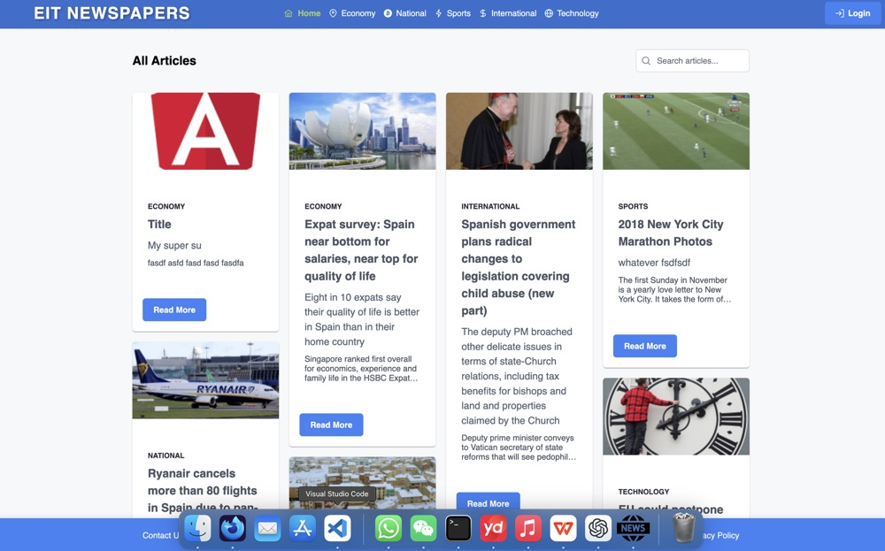
- **Windows:** 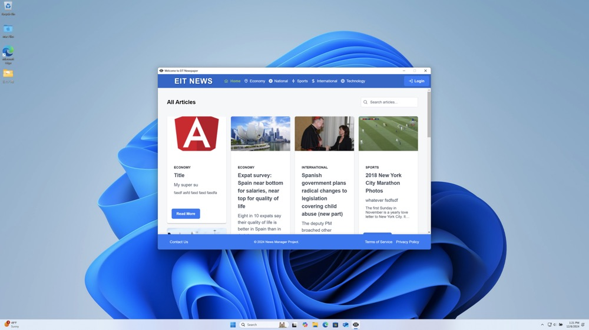
- **Linux(Ubuntu):** 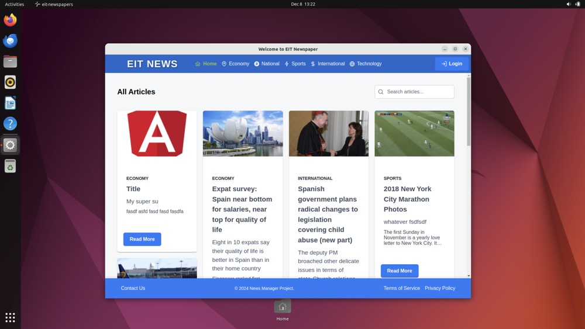
---

## Test Case 2.1: Notify on Article Creation/Deletion (Electron)

### **Description**
Ensure notifications appear in Electron when articles are created or deleted.

---

### **Steps Executed**

1. **Article Creation:**
   - Navigate to the "Create Article" page.
   - Fill out the form with valid article details.
   - Submit the form to create an article.
   - Verify a native Electron notification appears with the message: `"Article created successfully"`.

2. **Article Deletion:**
   - Navigate to the home page listing all articles.
   - Delete an existing article using the "Delete" button.
   - Confirm the deletion action in the confirmation dialog.
   - Verify a native Electron notification appears with the message: `"Article deleted successfully"`.

---

### **Expected Result**
- Native Electron notifications display for both creation and deletion actions.
- Clicking the notifications performs no further action.

---

### **Actual Result**
Test passed. Notifications for both actions displayed correctly, and clicking them performed no action.

---
### **Code Implementation**

**Notification Trigger for Article Creation:**

```javascript
ipcMain.handle('show-notification', async (_, { title, body, clickAction }) => {
  if (Notification.isSupported()) {
    const notification = new Notification({ title, body });
    notification.show();

    notification.on('click', () => {
      if (clickAction === 'openFile') {
        if (lastExportedFilePath) {
          shell.openPath(lastExportedFilePath).then((err) => {
            if (err) {
              console.error('Failed to open file:', err);
            }
          });
        } else {
          console.warn('No file path available to open on notification click.');
        }
      } else if (clickAction === 'scroll') {
        if (mainWindow && mainWindow.webContents) {
          mainWindow.webContents.send('notification-click');
        }
      }
    });

    return { success: true };
  } else {
    return { success: false, error: 'Notifications not supported on this platform.' };
  }
});

 // Add a showNotification function to the Electron service to support notification interaction between the main process and the renderer process.
 showNotification(title: string, body: string, clickAction: 'scroll' | 'openFile' = 'scroll'): void {
    if (this.isElectron() && this.ipcRenderer) {
      this.ipcRenderer.invoke('show-notification', { title, body, clickAction });
    } else {
      console.warn('Notification is not supported in this environment.');
    }
  }
```
---

### **Screenshots**
- **Notification on Article Creation:** 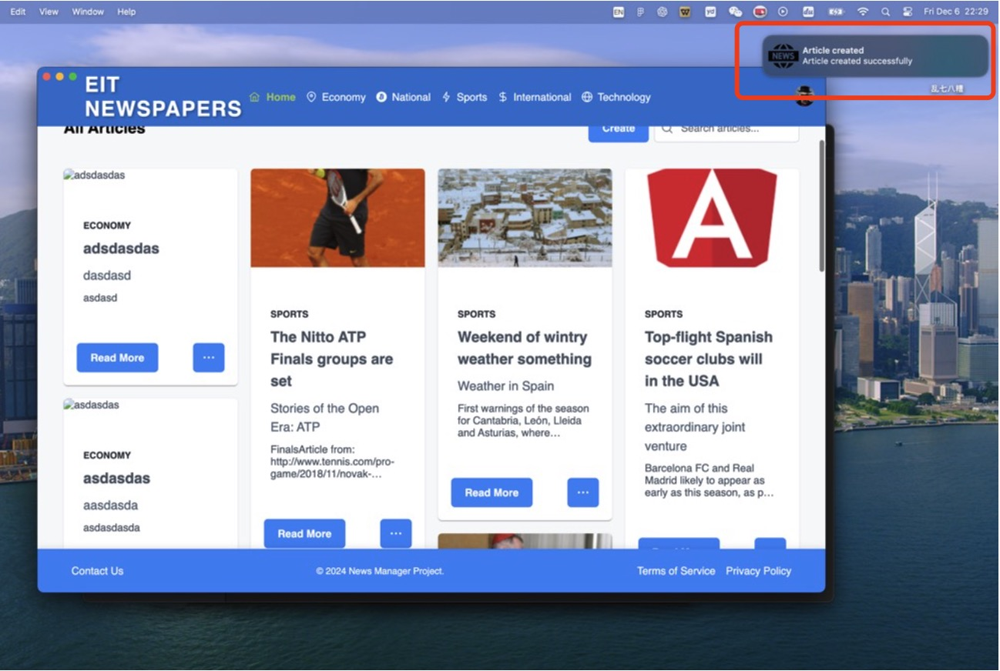
- **Notification on Article Deletion:** 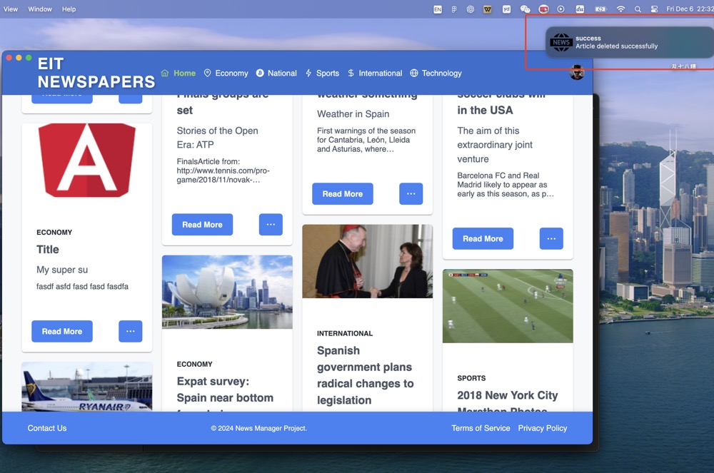

---

## Test Case 2.2: Error Notification During Form Validation (Electron)

### **Description**
Ensure Electron error notifications display and navigate users to the faulty field when clicked.

---

### **Steps Executed**

1. **Attempt Article Creation with Errors:**
   - Navigate to the "Create Article" page.
   - Submit the form without filling out all required fields.
   - Verify a native Electron error notification appears with the message: `"Article Title is required"`.
   
2. **Click Notification to Navigate:**
   - Click the error notification.
   - Verify the app scrolls to the faulty field (e.g., the `Title` input field).
   - Verify the field is focused for user correction.

---

### **Expected Result**
- An Electron error notification is displayed when attempting to create or edit an article with missing required fields.
- Clicking the notification scrolls to the faulty field and sets focus for editing.

---

### **Actual Result**
Test passed. Error notifications appeared as expected, and clicking them navigated to the faulty fields.

---

### **Screenshots**
- **Error Notification During Article Creation:** 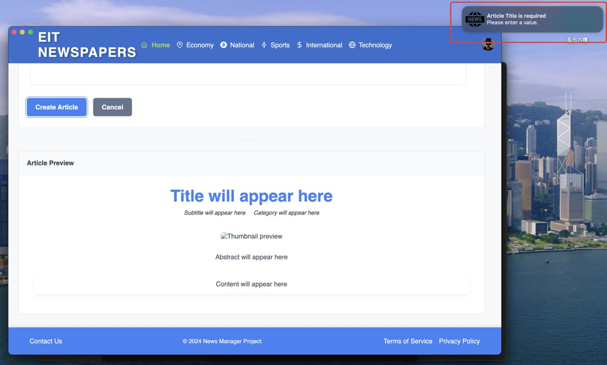
- **Focus on Faulty Field After Clicking Notification:** 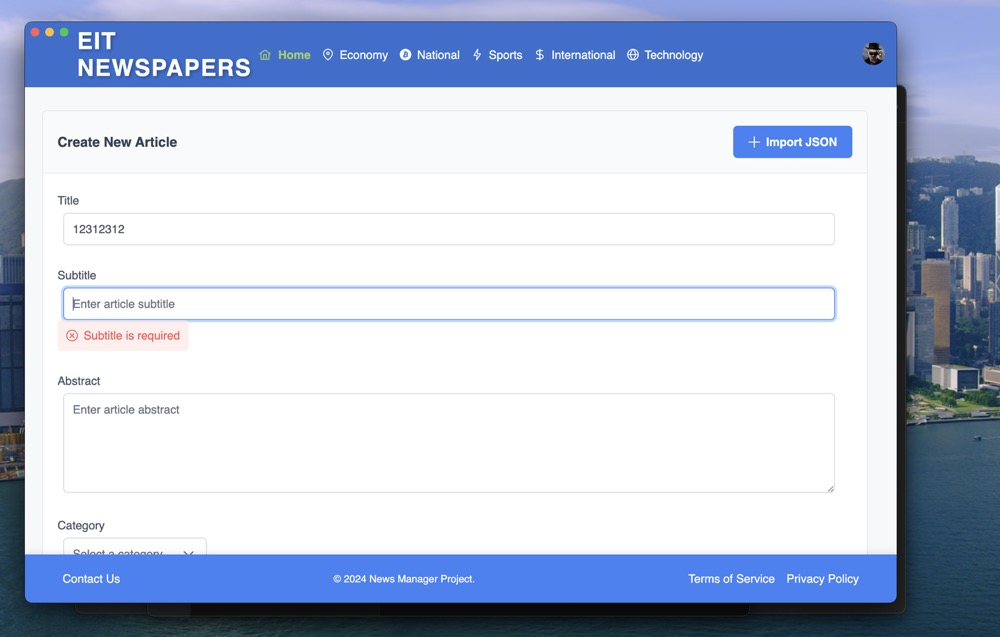

---

## Test Case 3.1: Save Token to Electron Store

### **Description**
Verify that the user’s session token is saved in Electron’s file-based local storage (`electron-store`) and persists across app restarts.

---

### **Steps Executed**

1. **Log In to the App:**
   - Open the app.
   - Enter valid credentials on the login screen.
   - Submit the login form.

2. **Check Token Saved in Electron Store:**
   - Open the Electron store file on the file system.
   - Confirm that the token is saved after login.

3. **Close and Relaunch the App:**
   - Close the application completely.
   - Relaunch the application.

4. **Verify Session Persistence:**
   - Confirm that the user remains logged in without needing to re-enter credentials.
   - Confirm that the app uses the token from `electron-store` to maintain the session.

5. **Log Out:**
   - Log out from the app.
   - Confirm that the token is cleared from `electron-store`.

---

### **Implementation**

The login and session management features were implemented primarily in the `LoginService`. Key functionalities include:

1. **Login Token Handling:**
   - On successful login, the user token is securely saved in `electron-store`.

2. **Session Persistence:**
   - The app retrieves the saved token from `electron-store` during initialization to maintain user sessions across app restarts.

3. **Logout Mechanism:**
   - Logging out clears the user token from `electron-store` and redirects the user to the login screen.

---

### **Expected Result**
- The user’s token is saved successfully in `electron-store`.
- The session persists across app restarts without requiring a login.
- Logging out clears the token and redirects the user to the login screen.

---

### **Screenshots**
- **Electron Store with Saved Token:** 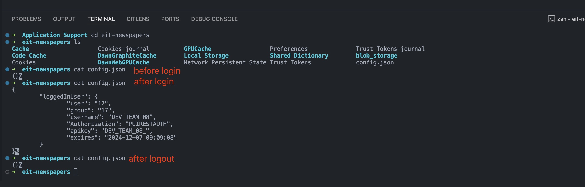

---

## Test Case 4.1: Export Article

### **Description**
Verify users can export articles as JSON files.

---

### **Steps**
1. Select an article from the list.
2. Click the **Export** button associated with the article.
3. Specify a location to save the file and click **Save**.
4. Open the saved file and verify its contents.

---

### **Expected Result**
A JSON file is created containing the correct article data, matching the selected article, and clicking the notification opens the file in the default JSON viewer/editor.

---

### **Implementation**
The exportArticle method handles exporting an article to a JSON file using Electron’s file-saving capabilities. It fetches the article data, formats it, and invokes Electron’s export functionality.
```javascript
exportArticle(articleId: string, overlayPanel?: OverlayPanel): void {
    this.newsService.getArticle(articleId).subscribe({
      next: (fullArticle: Article) => {
        const articleData = {
          Title: fullArticle.title || '',
          Subtitle: fullArticle.subtitle || '',
          Abstract: fullArticle.abstract || '',
          Category: fullArticle.category || '',
          Body: fullArticle.body || '',
        };
  
        if (overlayPanel) {
          overlayPanel.hide();
        }
  
        this.electronService.exportArticle(articleData)
          .then((result: { success: boolean; error?: string }) => {
            if (result.success) {
              this.showNotification('success', 'Article exported successfully', 'openFile');
            } else {
              if (result.error === 'Save operation canceled by user') {
                console.log('User canceled the save dialog, no notification shown.');
              } else {
                this.showNotification('error', 'Failed to export article: ' + (result.error || 'Unknown error'));
              }
            }
          })
          .catch(err => {
            this.showNotification('error', 'Failed to export article');
          });
      },
      error: (err) => {
        this.showNotification('error', 'Failed to fetch article for export');
      }
    });
  }
```

---

### **Screenshots**
- **Exporting Article:** 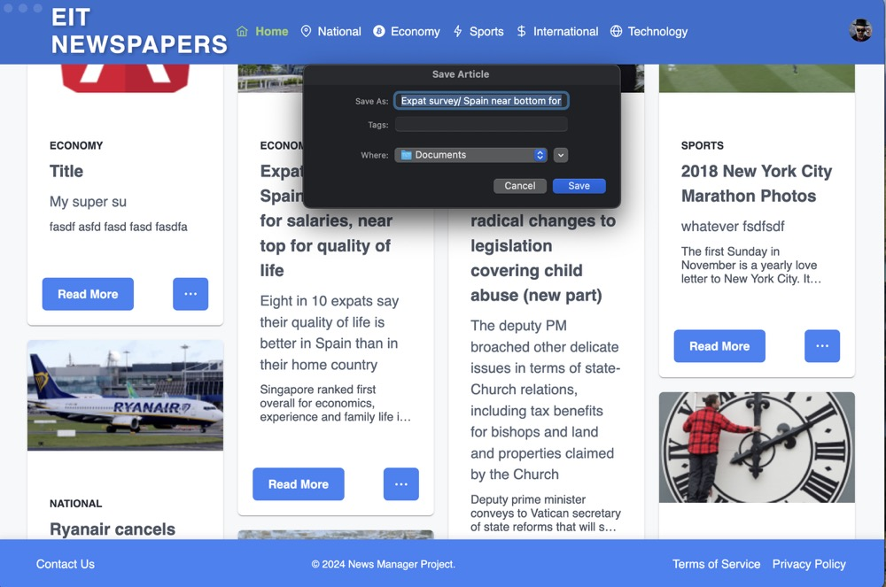
- **Exporting Article:** 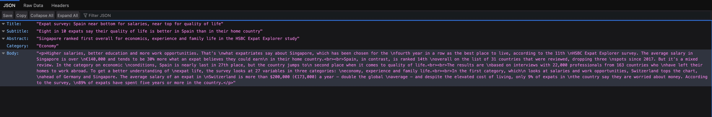
---

## Test Case 4.2: Import Article

### **Description**
Verify users can import JSON files to add articles.

---

### **Steps**
1. Navigate to the **Import Article** section in the app.
2. Select a valid JSON file containing article data.
3. Confirm the import operation.
4. Verify the article appears in the app.

---

### **Expected Result**
The article is successfully imported and displayed in the app, with all fields correctly populated from the JSON file.

---

### **Implementation**
The `onJsonFileSelect` method handles importing articles from JSON files. It validates the selected file, parses its content, and updates the application state with the imported article data.
```javascript
onJsonFileSelect(event: any) {
    const files = event.files;
    if (!files || files.length === 0) {
      this.onRevert();
      return;
    }

    const file = files[0];
    if (!file.name.toLowerCase().endsWith('.json')) {
      this.showNotification('error', 'Error', 'Only JSON files are allowed');
      this.onRevert();
      return;
    }

    const reader = new FileReader();
    reader.onload = e => {
      try {
        const content = (e.target as FileReader).result as string;
        const article = JSON.parse(content);
        this.setArticleValues(article);
      } catch (err) {
        this.showNotification('error', 'Error', 'Failed to parse JSON file');
        this.onRevert();
      }
    };
    reader.onerror = () => {
      this.showNotification('error', 'Error', 'Failed to read file');
      this.onRevert();
    };
    reader.readAsText(file);
  }
```

---

### **Screenshots**
- **Importing Article:** 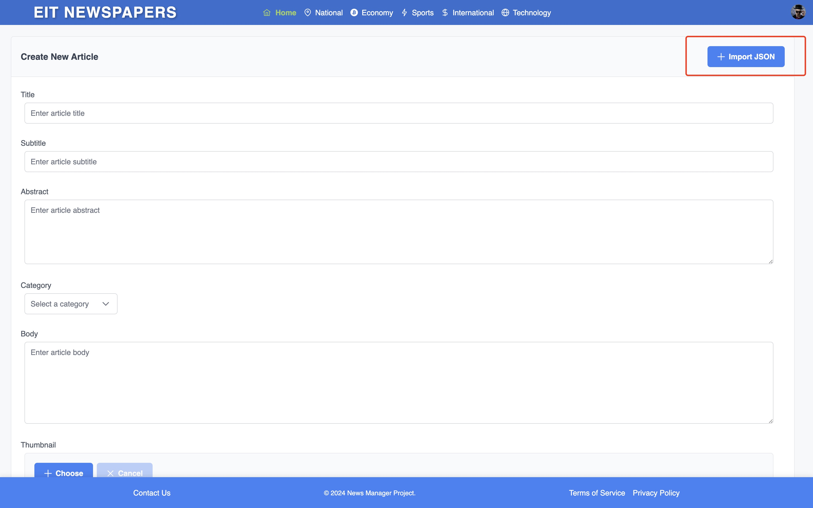  
  _Screenshot showing the "Import Article" page before selecting a file._
- **Imported Article Displayed:** 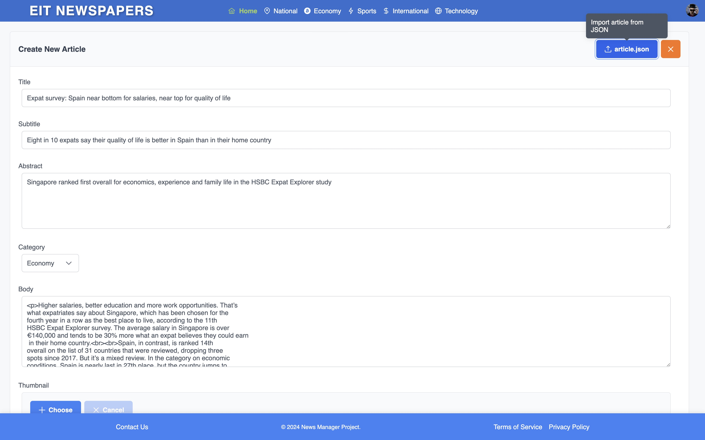  
  _Screenshot showing the imported article successfully displayed in the application._

## Test Case 5.1: Verify Native-Like UI Features

### **Description**
Ensure the application incorporates features that mimic native desktop application behavior to provide a seamless and professional user experience.

---

### **Implemented Features**

#### **1. Add a Draggable Fixed Header Bar**
- **Description:**  
  A fixed header bar allows users to drag the application window, replicating native desktop application behavior.
- **Implementation:** 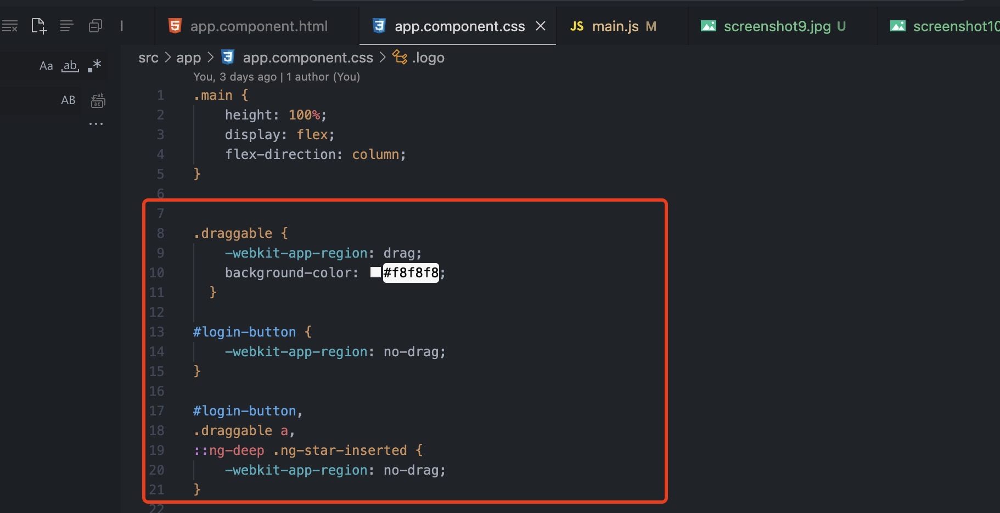  
- **Verification Steps:**
  1. Launch the application.
  2. Drag the application window by clicking and holding on the header bar.
  3. Ensure the window moves smoothly without affecting interactive elements.
- **Expected Result:**  
  Users can drag the application window seamlessly using the header bar.

---

#### **2. Turn Off Text Selection**
- **Description:**  
  To avoid web-like behavior, text selection is disabled globally across the application.
- **Implementation:**  
  ```javascript
    mainWindow.webContents.on('did-finish-load', () => {
    mainWindow.webContents.executeJavaScript(`
      function applyCustomStyles() {
        const style = document.createElement('style');
        style.textContent = \`
          * {
            user-select: none !important;
            -webkit-user-select: none !important;
            -ms-user-select: none !important;
            -moz-user-select: none !important;
          }
          a, button, input, textarea {
            cursor: default !important;
          }
        \`;
        document.head.appendChild(style);
      }

      applyCustomStyles();

      const observer = new MutationObserver(() => applyCustomStyles());
      observer.observe(document.body, { childList: true, subtree: true });
    `);
  });
    ```
- **Verification Steps:**
  1. Attempt to select text anywhere in the application, including labels, buttons, and headings.
  2. Verify that no text can be selected.
- **Expected Result:**  
  Text selection is disabled throughout the application.

---

#### **3. Don’t Show Window Until App Has Finished Loading**
- **Description:**  
  The application window remains hidden until the app is fully loaded, providing a smoother user experience.
- **Implementation:**  
  - Utilized a combination of Electron’s `window-ready` event and a controlled delay to display the window only when it is fully ready:
    ```javascript
    // Populate menu items and signal when ready
    this.populateMenuItems().then(() => {
      if (this.isElectronApp && window.electronAPI) {
        setTimeout(() => {
          window.electronAPI.windowReady();
        }, 2000); // Delay added for ensuring readiness
      }
    });

    // Handle the 'window-ready' signal in the Electron main process
    ipcMain.handle('window-ready', () => {
      if (mainWindow) {
        if (!mainWindow.isVisible()) {
          mainWindow.show(); // Show the window once ready
        }
      } else {
        console.error('[window-ready] No mainWindow instance found.');
      }
    });
    ```

  - Configured the `BrowserWindow` options to keep the window hidden during initialization:
    ```javascript
    const mainWindow = new BrowserWindow({
      show: false, // Prevents window from displaying immediately
      webPreferences: {
        contextIsolation: true,
        preload: preloadPath,
      },
    });
    ```
- **Verification Steps:**
  1. Launch the application.
  2. Observe that the window only appears after the app is fully loaded.
  3. Ensure no intermediate loading screens or unrendered UI is visible.
- **Expected Result:**  
  The application window displays only after the app is fully loaded.

---

#### **4. Turn Off Mouse Cursor When Hovering Links**
- **Description:**  
  To avoid web-like behavior, the mouse cursor does not change to a pointer when hovering over links or interactive elements.
- **Implementation:**  
  - Applied the following CSS styles to maintain the default cursor:
    ```javascript
    mainWindow.webContents.on('did-finish-load', () => {
    mainWindow.webContents.executeJavaScript(`
      function applyCustomStyles() {
        const style = document.createElement('style');
        style.textContent = \`
          * {
            user-select: none !important;
            -webkit-user-select: none !important;
            -ms-user-select: none !important;
            -moz-user-select: none !important;
          }
          a, button, input, textarea {
            cursor: default !important;
          }
        \`;
        document.head.appendChild(style);
      }

      applyCustomStyles();

      const observer = new MutationObserver(() => applyCustomStyles());
      observer.observe(document.body, { childList: true, subtree: true });
    `);
  });
    ```
- **Verification Steps:**
  1. Hover the mouse cursor over links, buttons, or input fields.
  2. Verify that the cursor retains the default appearance.
- **Expected Result:**  
  The mouse cursor remains consistent and does not change to a pointer when hovering over links or interactive elements.

---

## **Summary**

The testing process confirmed that the application functions reliably across platforms and meets key requirements for usability and performance. From launching as a native desktop app to managing sessions, importing/exporting articles, and providing a polished desktop-like experience, all critical features were verified successfully.

### **Key Outcomes:**
- The app operated smoothly on Windows, macOS, and Linux without errors.
- Notifications and error handling enhanced user feedback and clarity.
- Import/export functionalities and session persistence worked as expected, ensuring data security and usability.

### **Conclusion:**
The application passed all major tests, demonstrating its reliability, user-friendliness, and alignment with core desktop application standards.


  